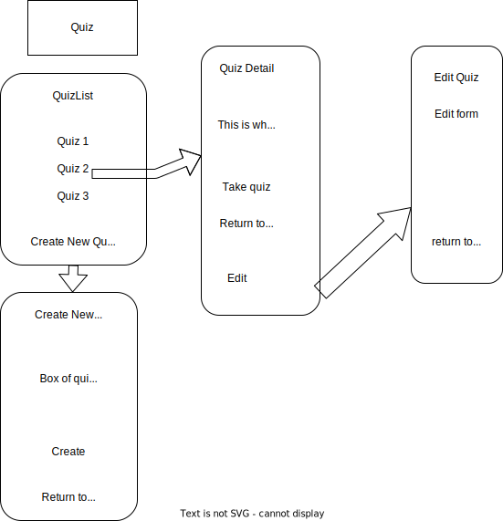

# Quiz CRUD, REACT Firebase

## By Kim & Gabe

## TODO
*  quiz is not displaying created radio button 4 answers with the value as the label.
*  want display answers to user
* want to score the quiz and display score?
* how to know which answer is right/wrong per question per quiz?

* display on UI who is logged in...

* database: user profile, stats, page on UI with list of quizzes created and taken?
* more database digging to add functionality

* obv. styling

* connect to firebase.

* allow results submitted to db
* user sign in, out, up (to join)
* user have own dashboard with quiz list.

## Component Diagram
 

## Technologies Used

* Html
* Javascript, ES6
* CSS
* create-react-app
* React
* npm 
* ESLint
* Git
* React Hooks (useState)
* Firebase (BaaS) and firestore database

###  This app will allow a user to:
    -tbd

## Setup/Installation Requirements

1. Navigate to [my github repository](https://github.com/kimmykokonut/quiz-of-choice) for this project 

2. Click the `Fork` button and  you will be taken to a new page where you can give your repository a new name and description. Choose "create fork".

3. Click the `Code` button and copy the url for HTTPS.

4. On your local computer, create a working directory for my files and name appropriately.

5. On your terminal, type `$ git clone 'url'` (using the url from step 3.)

6. On your terminal, type `$ code .` to open in VS Code.  If you do not have VS Code Editor, you may download [here](https://code.visualstudio.com/)

7. Once in VS Code, open the terminal there and type 
`$ npm install` (to install the packages and dependencies). 
You may also need to install bootstrap and uuid with these terminal commands: `$ npm install bootstrap`, 
`$ npm install uuid`

8.  Now you can access my code. 
* To launch the dev server, run `$ npm run start`
* To build the project for production, run `$ npm run build`

_If this is too much and you just want to see what it looks like, go to my [github pages](https://kimmykokonut.github.io/quiz-of-choice)_

### Optional:
* To learn more about npm, [go here](https://www.freecodecamp.org/news/what-is-npm-a-node-package-manager-tutorial-for-beginners/)
* To learn more about Redux Toolkit, [go here](https://redux-toolkit.js.org/introduction/getting-started)

## Known Bugs
* WIP

## License
MIT License. See license.md for further information

Getting Started with Create React App

This project was bootstrapped with [Create React App](https://github.com/facebook/create-react-app).

## Available Scripts

In the project directory, you can run:

### `npm start`

Runs the app in the development mode.\
Open [http://localhost:3000](http://localhost:3000) to view it in your browser.

The page will reload when you make changes.\
You may also see any lint errors in the console.

### `npm test`

Launches the test runner in the interactive watch mode.\
See the section about [running tests](https://facebook.github.io/create-react-app/docs/running-tests) for more information.

### `npm run build`

Builds the app for production to the `build` folder.\
It correctly bundles React in production mode and optimizes the build for the best performance.

The build is minified and the filenames include the hashes.\
Your app is ready to be deployed!

See the section about [deployment](https://facebook.github.io/create-react-app/docs/deployment) for more information.

### `npm run eject`

**Note: this is a one-way operation. Once you `eject`, you can't go back!**
## Learn More

You can learn more in the [Create React App documentation](https://facebook.github.io/create-react-app/docs/getting-started).

To learn React, check out the [React documentation](https://reactjs.org/).